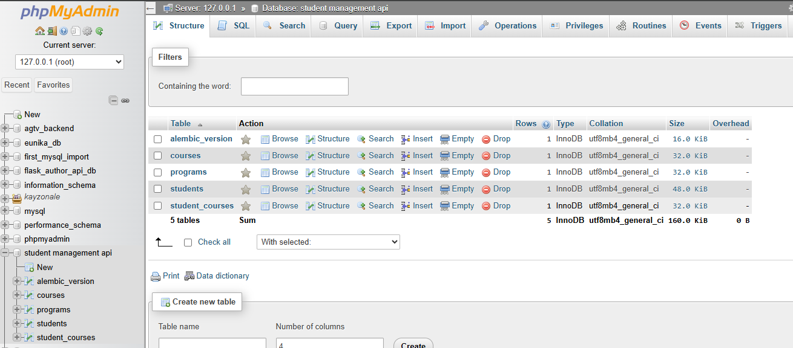
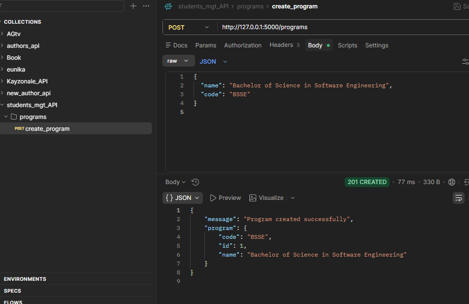
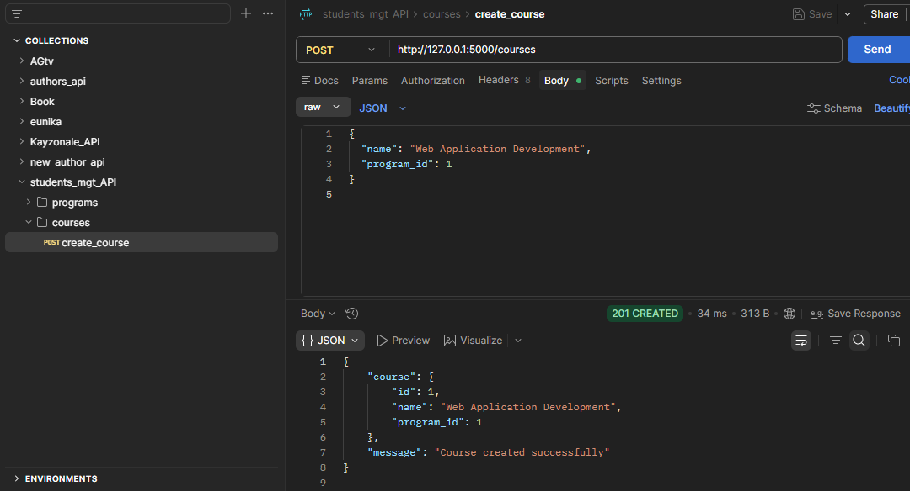
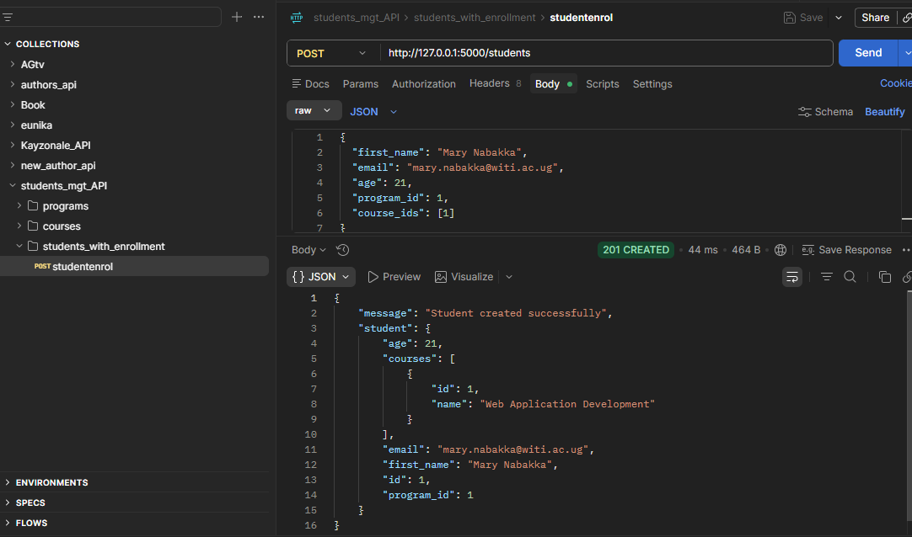
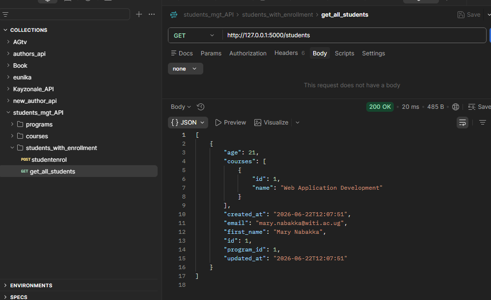
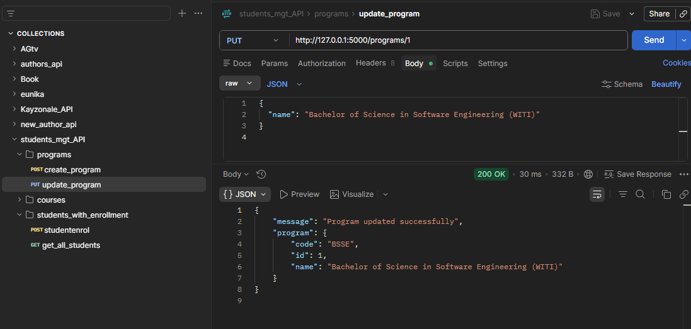
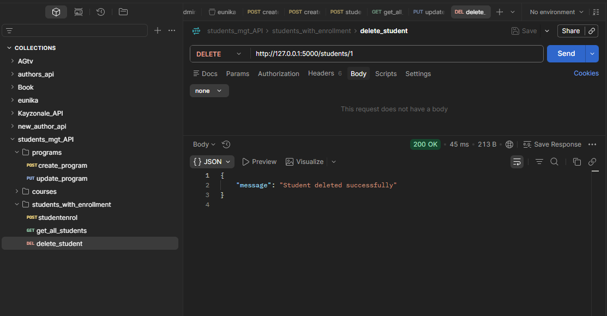

# 🎓 Student Management System API (Question1)
screenshots for testing in postman

This is Student Management System API, developed for the Semester Two Python Exam. its a robust and Flask RESTful API designed to manage programs, courses, and students, maintaining full database integrity with migrations, strict schema relationships, and comprehensive input validations.

#Question 1 attempted

Contributions
only one person worked on it
BRIGHT JEMIMMAH,i Defined `Program` & `Course` models. Implemented `POST /programs` & `POST /courses`. | Google Drive Video Link (i will put my link  here after recording) 

 Features & Technical Implementation

1. I Built it using the Flask Application Factory. Route logic is separated into modular,Flask Blueprints

2. Database Schema & Timestamps: All models include `created_at` and `updated_at` timestamps using`db.Column(db.DateTime, default=datetime.utcnow)``onupdate=datetime.utcnow`

3. The Many-to-Many Relationships is Implemented by student_courses association table to represent that a student can enroll in many courses.

4. Data Validation & Integrity Checks
   Rejects missing or malformed JSON payloads (`400 Bad Request`).
   Validates that mandatory parameters are supplied.
   Restricts program code duplication (`409 Conflict`).
   Ensures email syntax is valid and unique globally (`400 Bad Request` or `409 Conflict`).
   Verifies the existence of related entities e.g. checking that a `program_id` exists before adding a student or course to it to prevent internal database errors (`404 Not Found`).

## Database Models
 1. Program
id (Integer, Primary Key)
name(String, nullable=False)
code(String, Unique, nullable=False)
created_at or updated_at(DateTime)
Relationships Has many `courses`, has many `students`.

 2. Course
id(Integer, Primary Key)
name(String, nullable=False)
program_id(Integer, Foreign Key referencing `programs.id`, nullable=False)
created_at or updated_at(DateTime)

3. Student
id (Integer, Primary Key)
first_name(String, nullable=False)
email(String, Unique, nullable=False)
age(Integer, Optional)
program_id(Integer, Foreign Key referencing `programs.id`, nullable=False)
created_at or updated_at(DateTime)
Relationships are Many-to-many  with `Course` via `student_courses` association table.

# API Endpoints & Usage(screen shots are provided at the start of the .MD)
 1. Program Endpoints
`POST /programs`
Create a new program.
  {
    "name": "Bachelor of Science in Software Engineering",
    "code": "BSSE"
  }

Success Response (201 Created)

  {
    "message": "Program created successfully",
    "program": {
      "id": 1,
      "name": "Bachelor of Science in Software Engineering",
      "code": "BSSE"
    }
  }

 `PUT /programs/<id>`
Update program details by ID.
  {
    "name": "Bachelor of Science in Software Engineering (WITI)"
  }

Success Response (200 OK)
  {
    "message": "Program updated successfully",
    "program": {
      "id": 1,
      "name": "Bachelor of Science in Software Engineering (WITI)",
      "code": "BSSE"
    }
  }
NOTE: i have provided screenshots of some of the tests made using postman

Setup & Installation Instructions
Step 1: Clone the Repository with git clone https://github.com/gorretgolden/Python-Cohort-4-Exam-Y1S2-Startup-Files
cd Python-Cohort-4-Exam-Y1S2-Startup-Files

Step 2: Set Up a Virtual Environment & Install Dependencies
python -m venv venv,  Activated on Windows:venv\Scripts\activate, run pip install -r requirements.txt to get the requiremnts.txt file

 Step 3: Configure Environment Variables
I Created a `.env` file in the root directory 

Step 4: Run Database Migrations
I ensured that MySQL server is running, and that the target database exists.
flask db init
flask db migrate -m "initial migration"
flask db upgrade

Step 5: Start the Development Server
python run.py
The server started on `http://127.0.0.1:5000/`.

